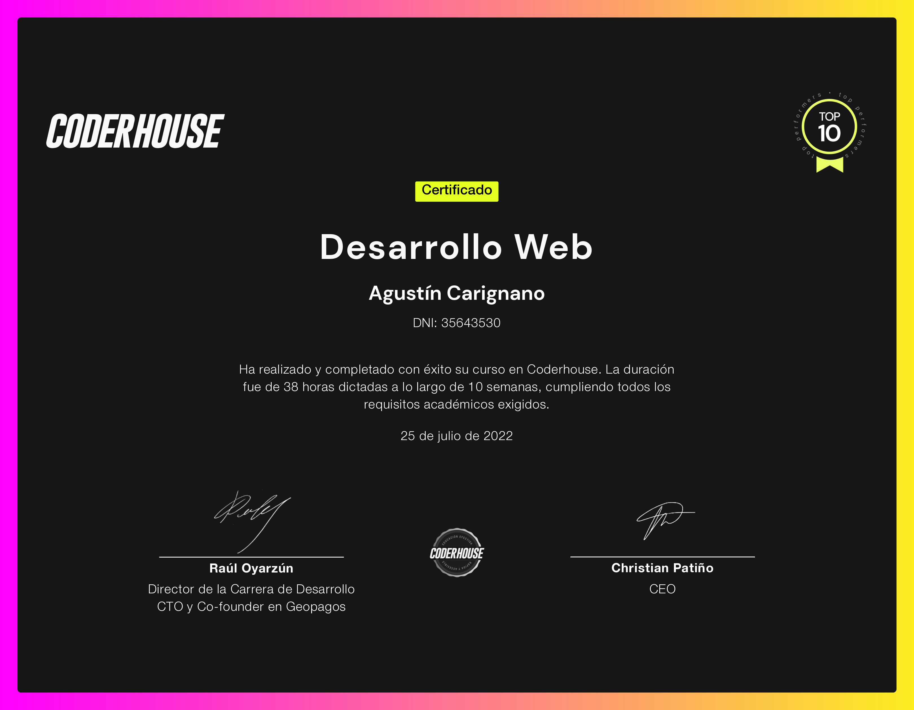

<h1 align="center"> Barroca - JS Project </h1>

Barroca es un e-commerce de ropa, el cual desarrollé como proyecto del curso de desarrollo web. Es una página web estática, en la que apliqué los conceptos aprendidos sobre HTML, CSS, Bootstrap, SASS y GIT.

## Breve descripción.

La idea para el sitio web surgió a partir del emprendimiento de negocio de una amiga, la cual vende los productos que en el se publicitan. Debido a que es mi primera aproximación con la programación web, es un sitio que necesita crecer para sumar interactividad con el usuario

## Deploy del proyecto

Para visualizar la web, haz click en el siguiente enlace: [Barroca](https://agustincarignano.github.io/barroca-carignano-project/)

## Descargue una copia del repositorio:

    git clone https://github.com/AgustinCarignano/barroca-carignano-project.git

## Créditos

Profesor: Sanchez, Sebastián.

Alumno: Carignano, Agustín.

## Certificado del curso

